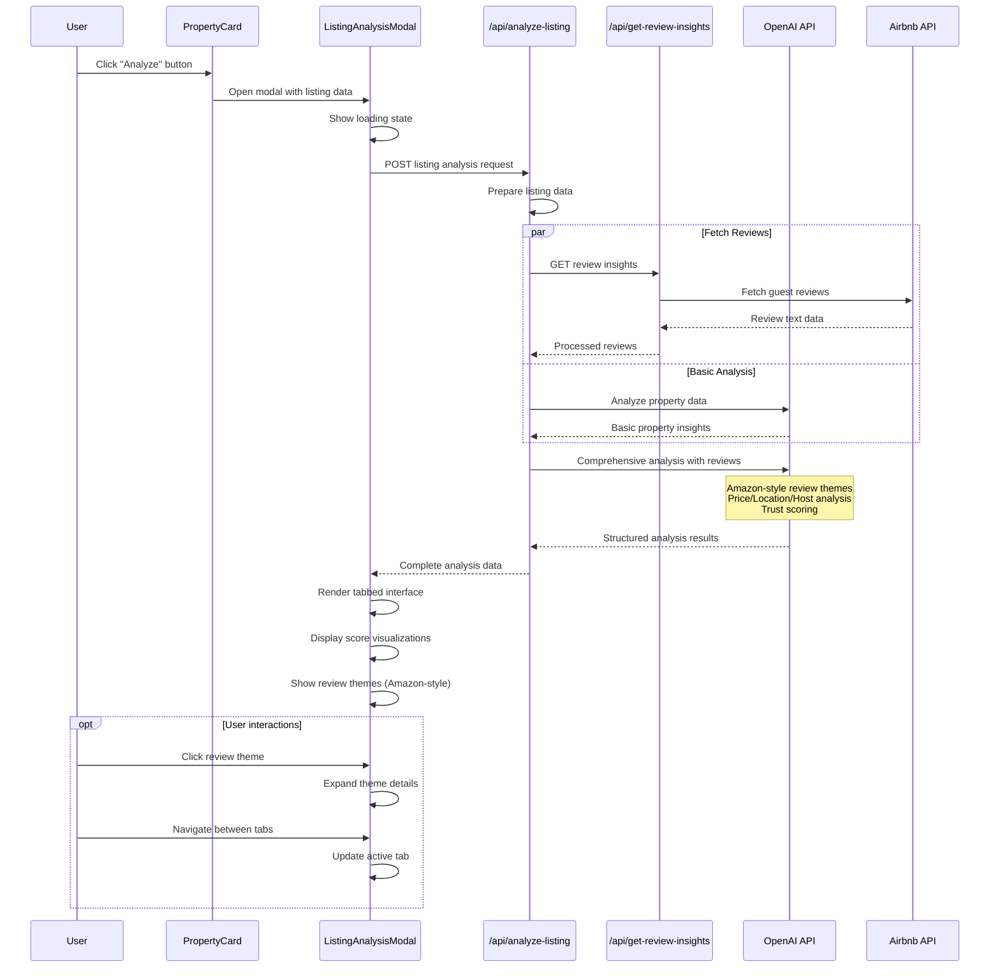
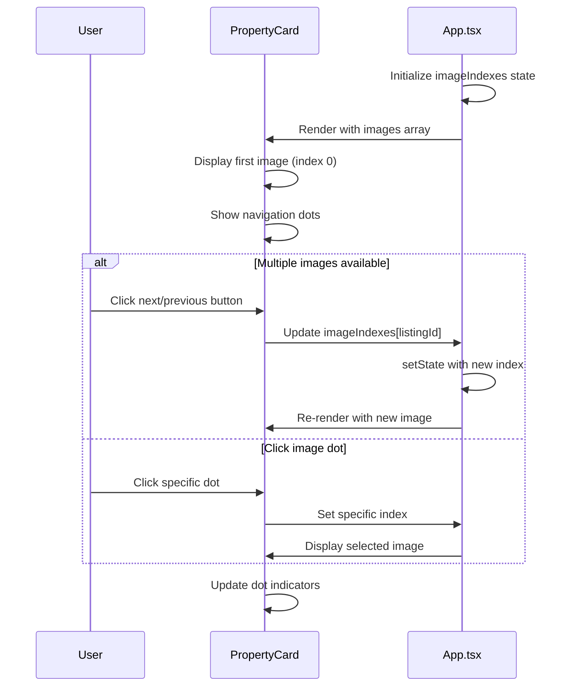
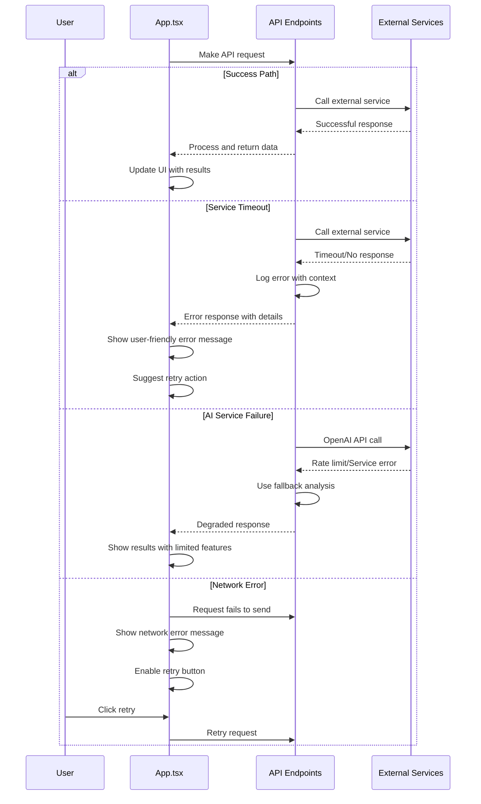
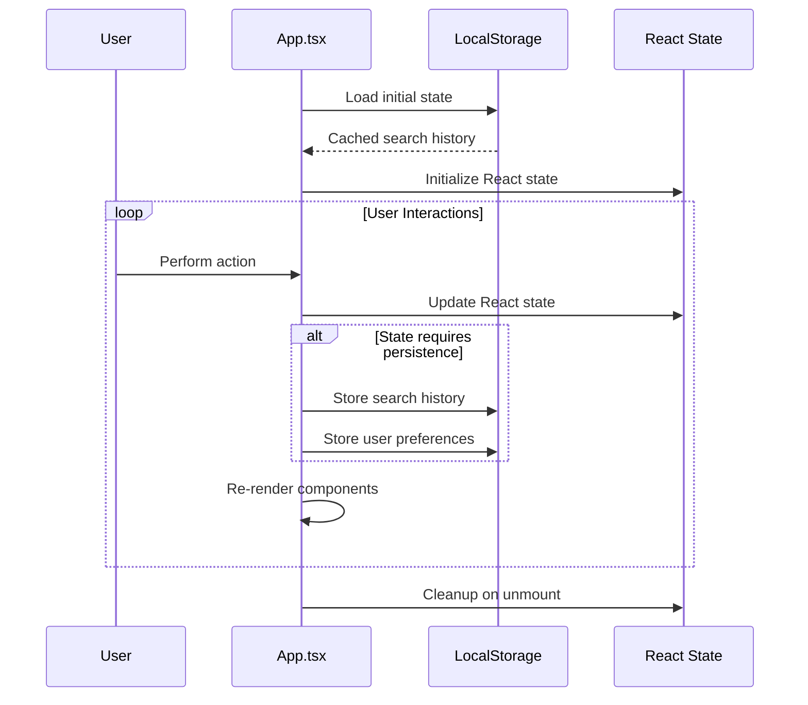

# Airbnb Search Application - Sequence Diagrams

## Main Search Flow

```mermaid
sequenceDiagram
    participant U as User
    participant A as App.tsx
    participant CQ as /api/classify-query
    participant AQ as /api/analyze-query
    participant G as Geocoding Service
    participant O as OpenAI API
    participant US as /api/unified-search
    participant AB as Airbnb HTTP API
    participant RA as RefinementAnalyzer

    U->>A: Enter search query
    A->>A: Set loading state
    
    A->>CQ: POST query classification
    CQ->>O: Classify intent (search/travel/refinement)
    O-->>CQ: Classification result
    CQ-->>A: Query type & confidence
    
    alt Query Type: search
        A->>AQ: POST analyze query
        AQ->>O: Extract structured criteria
        O-->>AQ: Parsed location, dates, filters
        AQ->>G: Validate location
        G-->>AQ: Location validation/disambiguation
        AQ-->>A: Enhanced search criteria
        
        opt Location disambiguation needed
            A->>A: Show LocationDisambiguationModal
            U->>A: Select location
            A->>A: Update search context
        end
        
        A->>US: POST unified search
        US->>US: Build Airbnb API parameters
        US->>AB: GET search listings
        AB-->>US: Raw property data
        US->>US: Transform to unified format
        US->>US: Calculate trust scores
        US->>O: Apply semantic filtering
        O-->>US: Filtered results
        US-->>A: Processed listings
        
        A->>RA: Analyze results for refinements
        RA-->>A: Quick filter suggestions
        A->>A: Update results panel & show listings
        
    else Query Type: travel_question
        A->>+/api/travel-assistant: POST travel query
        /api/travel-assistant->>O: Generate travel advice
        O-->>-/api/travel-assistant: Contextual response
        /api/travel-assistant-->>A: Travel advice + follow-ups
        A->>A: Add assistant message with suggestions
    end
    
    A->>A: Update chat history
    A->>A: Store in localStorage
```

## Listing Analysis Flow



## Search Refinement Flow

```mermaid
sequenceDiagram
    participant U as User
    participant A as App.tsx
    participant QF as QuickFilter Component
    parameter DE as DateEditor
    participant RA as RefinementAnalyzer
    participant US as /api/unified-search

    A->>RA: Analyze current results
    RA->>RA: Generate price insights
    RA->>RA: Analyze amenity patterns
    RA->>RA: Calculate property type distribution
    RA-->>A: Refinement suggestions
    
    A->>QF: Render quick filters
    
    alt Price Filter
        U->>QF: Click price range filter
        QF->>A: Update search context
        A->>US: Re-search with new price range
        US-->>A: Filtered results
        
    else Amenity Filter
        U->>QF: Select amenity filter
        QF->>A: Add amenity requirement
        A->>A: Filter current results locally
        
    else Date Change
        U->>DE: Modify check-in/out dates
        DE->>A: Update search context
        A->>US: Re-search with new dates
        US-->>A: Updated availability
        
    else Follow-up Question
        U->>A: Click follow-up suggestion
        A->>A: Process as new search query
        note over A: Triggers main search flow
    end
    
    A->>A: Update results display
    A->>RA: Re-analyze for new refinements
    RA-->>A: Updated suggestions
```

## Image Navigation Flow



## Error Handling Flow



## State Management Flow

